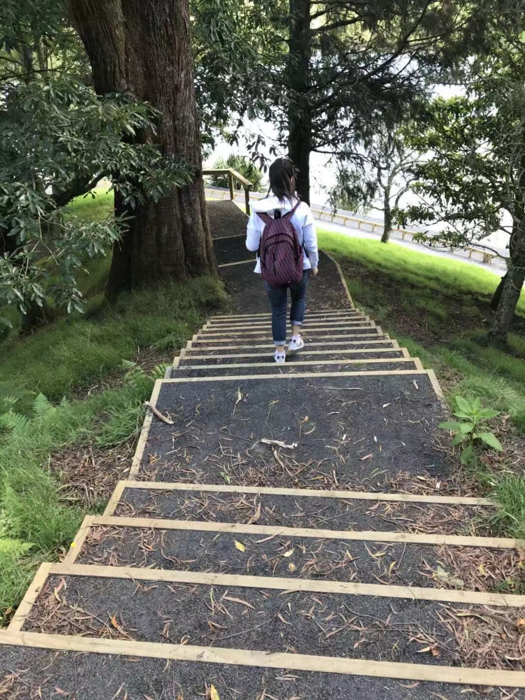

#### This is me:

#### Introduction

I received a BS in Biological Science in [Ocean University of China](http://eweb.ouc.edu.cn/) in 2015 and my graduate project was advised by Kuiran Li focusing on marine environmental data analysis in Guangzhou.

Now i am pusuing a master's degree on Biostatistics in [Columbia University](https://www.columbia.edu).

You can also see my experience by clicking on "CV" icon

#### Contact Information

Name: Shuyi SHEN

TEL: 6465935016

Email:[ss5929@cumc.columbia.edu](mailto:ss5929@cumc.columbia.edu)

Address: 
100 Haven Ave, Tower 3
New York, NY, 10032

